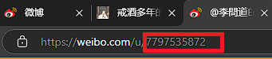

# WeiboAPI

基于 `m.weibo.cn` 相关接口封装的访问新浪微博的API。主要用于微博相关的数据获取。

## 0. 安装

> Note: 目前该包已同步发布至 npm registry，因此您可以直接使用 `npm install @hk-artificial-intelligence-association/weibo-api` 进行安装。

目前该 package 存放在 github 的 npm registry 下，因此在安装时，您需要在您的项目目录里添加 `.npmrc` 文件，并且添加以下行：

```.npmrc
@hk-artificial-intelligence-association:registry=https://npm.pkg.github.com/
```

而后运行：

```bash
npm install @hk-artificial-intelligence-association/weibo-api@latest
```

## 1. 使用示例

目前，对于通常的需求而言:
- 提供了获取指定微博用户前十条最新微博的 API 函数 `fetchUserLatestWeiboByUID` :
- 提供了获取指定微博用户前十条最新微博的 API 函数 `fetchUserLatestWeiboByUIDWithoutParsed` :
- 提供了搜索指定用户的 UID 的 API 函数 `searchForUserUID` :


```typescript
import {
  fetchUserLatestWeiboByUID,
  fetchUserLatestWeiboByUIDWithoutParsed,
  analyazeWeiboInfoToOneSentenceSummary,
  parseCardInfosToWeiboInfos,
  type WeiboInfo,
  type Card
} from '@hk-artificial-intelligence-association/weibo-api'

// 使用示例
// 获取指定uid的用户最新微博
async function getLatestWeibo(uid: string) {
  // fetchUserLatestWeiboByUID 会自动对结果进行解析，它会将结果转换为我们自己定义的类型 WeiboInfo ，提取出一些关键信息
  const weiboInfo = await fetchUserLatestWeiboByUID(uid)
  console.log('最新微博信息:', weiboInfo)
}

// 获取未解析的用户最新微博
async function getLatestWeiboWithoutParsing(uid: string) {
  // fetchUserLatestWeiboByUIDWithoutParsed 会获取 Card[] 信息，它对应于接口  https://m.weibo.cn/api/container/getIndex 返回体里 data.cards 的数据
  const rawWeiboData = await fetchUserLatestWeiboByUIDWithoutParsed(uid)
  console.log('未解析的微博数据:', rawWeiboData)
}


async function analyzeWeibo(uid: string) {
  const weiboInfo = await fetchUserLatestWeiboByUID(uid)
  // 分析 WeiboInfo 并生成一句话摘要
  // 如果想要将微博原数据转化为 "XXX 在 2024-01-01 23:59 发布了一条微博，微博内容为：" 这样的语句，可以使用该分析函数
  const summary = await analyazeWeiboInfoToOneSentenceSummary(weiboInfo[0])
  console.log('微博摘要:', summary)
}


function parseCards(cards: Card[]) {
  // 将卡片信息解析为微博信息
  const weiboInfos: WeiboInfo[] = parseCardInfosToWeiboInfos(cards)
  console.log('解析后的微博信息:', weiboInfos)
}

// 获得指定用户名的 UID
function searchForUserUID(username: string) {
  const uid = searchForUserUID(username)
  if(uid === null) {
    console.log('搜索不到该用户')
  } else {
    console.log('搜索到的用户 UID:', uid)
  }
}


```

## 2. UID 的获取

1. 通过搜索引擎等，在**网页端**找到你想要找的博主，进入ta的主页：


2. 在对应主页的顶端 `https://weibo.com/u/7797535872` 的 `/u/` 后跟的数字便是 UID。 



3. **需要注意的是**，部分用户可能是不能被我们使用的接口访问到的。因此，你需要访问 `https://m.weibo.cn/u/{你获取的UID}` 这个页面，看看能不能这个页面能否正常访问。如果可以，那么便可以使用本包的封装函数访问。

## 3. 关键的类型定义

`WeiboInfo` 是本包自定义的关键的类型：

```typescript
/**
 * 目前看起来只有发原创推文和转发推文的情况
 */
export type WeiboUserActionType = 'tweet' | 'retweet'


/**
 * 在微博存在图片时，才会出现该类型的字段，字段名为 pics
 */
export type Pic = {
    pid:string
    /**
     * 如果是 large，那么 url 是高清图;如果是 orj369，那么 url 是对应缩略图
     */
    size:string
    url:string
    large:Pic
    geo:{
        width:number
        height:number
        croped:boolean
    }
}

export type ParsedWeiboUserInfo = {
  id: number,
  name: string,
  avatar: string,
  description: string
}

export type BaseWeiboInfo = {
  action: WeiboUserActionType
  user: ParsedWeiboUserInfo
  text: string
  rawText: string
  /**
   * 点赞数
   */
  attitudesCount: number
  /**
   * 评论数
   */
  commentsCount: number
  /**
   * 转发数
   */
  retweetCount: number
  createdAt: string
  /**
   * 博文 Id
   */
  weiboId: string
  /**
   * 发微博的Ip定位
   */
  region?: string
  /**
   * 微博图片，如果不存在图片，那么该解析字段的结果是空数组
   */
  pics: Pic[]
}

/**
 * 原创推文
 */
export type OrginalWeiboInfo = BaseWeiboInfo & {
  action: 'tweet'
}

/**
 * 转发的推文
 */
export type RetweetWeiboInfo = BaseWeiboInfo & {
  action: 'retweet'
  retweetedWeibo: OrginalWeiboInfo
}

export type WeiboInfo = OrginalWeiboInfo | RetweetWeiboInfo
```

`WeiboInfo` 的示例数据：

```json
{
  user: {
    id: 7797535872,
    name: '李問道Erika',
    avatar: 'https://wx3.sinaimg.cn/orj480/008vHFhCly8h7gdpq3zepj30u00u0jru.jpg',
    description: '痛苦。已卸载app端微博。'
  },
  text: '轉發微博',
  rawText: '轉發微博',
  attitudesCount: 0,
  commentsCount: 0,
  retweetCount: 0,
  createdAt: 'Wed Sep 18 12:11:03 +0800 2024',
  weiboId: '5079927940186629',
  region: '发布于 浙江',
  action: 'retweet',
  retweetedWeibo: {
    action: 'tweet',
    user: {
      id: 1706699904,
      name: 'i陆三金',
      avatar: 'https://ww2.sinaimg.cn/orj480/65ba2c80jw1e8qgp5bmzyj2050050aa8.jpg',
      description: '机器人、自动驾驶、AI 视频及相关'
    },
    text: '再次读到了 OpenAI 创立之始定下的技术目标，穿透时间，仍具有很强的指引作用。稍作删减：<br /><br />《OpenAI 技术目标》，2016 年 6 月 20 日，by Ilya Sutskever、Greg Brockman、Sam Altman、Elon Musk。<br /><br />「OpenAI 的使命是建立安全的人工智能，并确保人工智能的收益尽可能广泛而均衡地分配。<br /><br />为智能下定 ...<a href="/status/5036474810502028"> 全文</a>',
    rawText: undefined,
    attitudesCount: 0,
    commentsCount: 3,
    retweetCount: 54,
    createdAt: 'Tue May 21 14:23:51 +0800 2024',
    weiboId: '5036474810502028',
    region: '发布于 北京'
  }
}
```


## CONTRIBUTION

欢迎提交PR或ISSUE完善本包的功能。

## CONTRIBUTORS

<a href="https://github.com/HK-Artificial-Intelligence-Association/WeiboAPI/graphs/contributors">
  
</a>